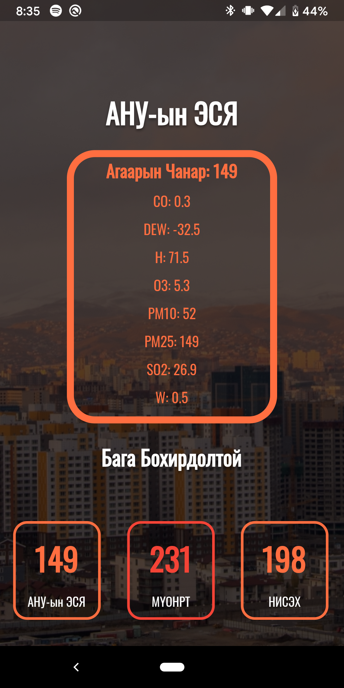

# AirUB

An iOS and Android App that provides real time air pollution information from Ulaanbaatar, Mongolia,
one of the most polluted cities in the world.

## About AirUB

This project was the result of an intersession during which I had no idea what to do. So, I decided
to learn how to write apps using Flutter, Google's cross platform development library. Since this is
my first app, it might have a few bugs.

A few resources to get you started if you want to build an app using Flutter:

- [Lab: Write your first Flutter app](https://flutter.dev/docs/get-started/codelab)
- [Cookbook: Useful Flutter samples](https://flutter.dev/docs/cookbook)

For help getting started with Flutter, view Google's
[online documentation](https://flutter.dev/docs), which offers tutorials,
samples, guidance on mobile development, and a full API reference.
